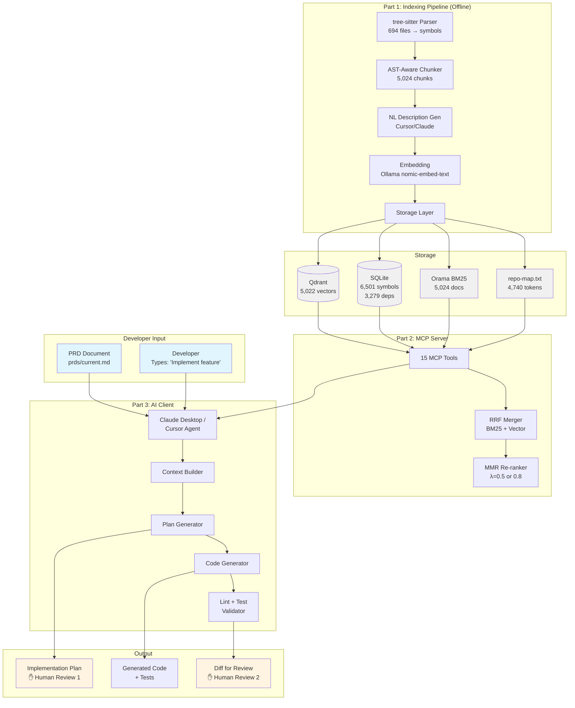
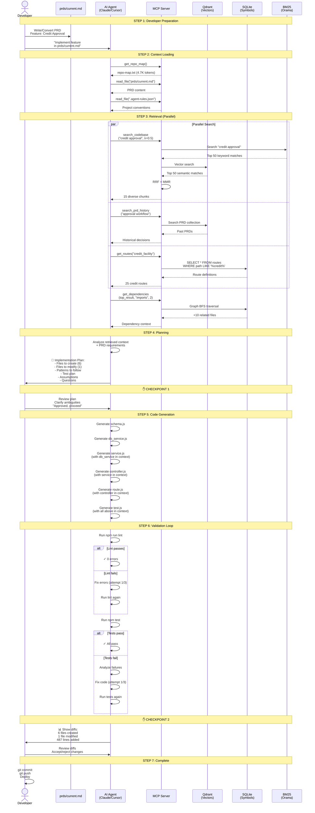
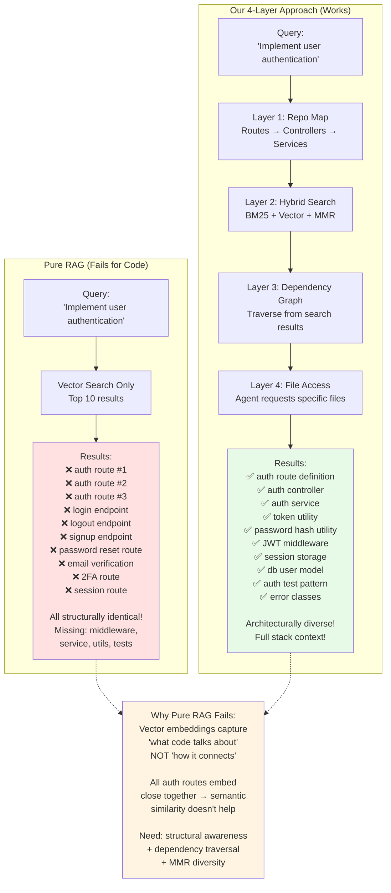
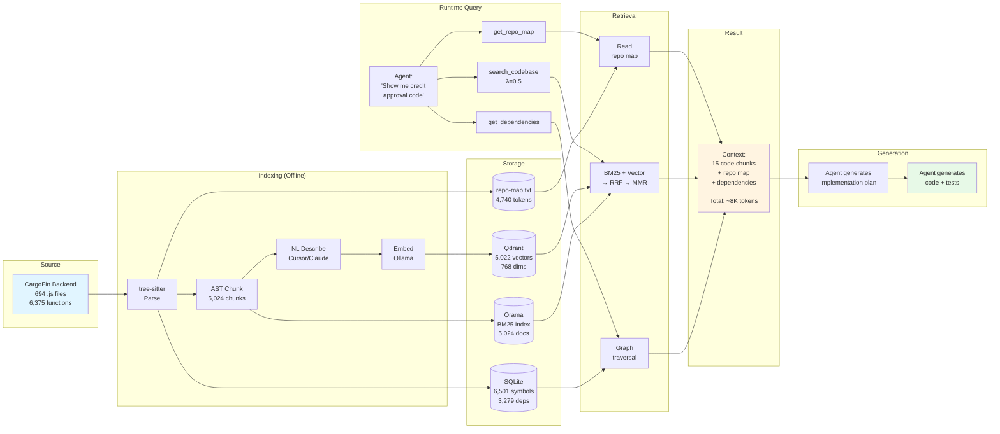
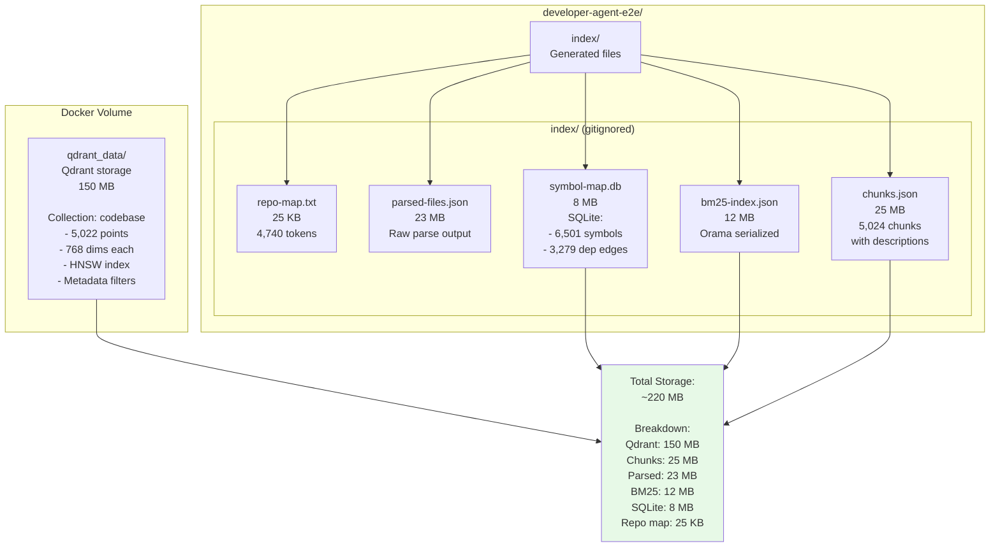

# PRD-to-Feature Agent: System Diagrams

This document contains visual diagrams for the PRD-to-Feature Agent system. These diagrams use Mermaid syntax and can be rendered in:
- GitHub/GitLab (natively)
- VS Code (with Mermaid extension)
- Online tools like [mermaid.live](https://mermaid.live)

---

## 1. High-Level Architecture



---

## 2. The 4-Layer Retrieval Stack

```mermaid
graph TB
    Query[Agent Query:<br/>'Implement rate limiting for<br/>credit facility endpoints']
    
    subgraph "Layer 1: Repo Map (Always in Context)"
        RepoMap[repo-map.txt<br/>4,740 tokens<br/><br/>Routes, Controllers,<br/>Services mapped<br/>with PageRank scores]
    end
    
    subgraph "Layer 2: Hybrid Search"
        BM25Search[BM25 Keyword Search<br/>Top 50 results<br/>Orama in-memory]
        VectorSearch[Vector Semantic Search<br/>Top 50 results<br/>Qdrant cosine similarity]
        RRFMerge[RRF Merge<br/>Combine rankings<br/>score = 1/(k + rank)]
        MMRRank[MMR Re-rank<br/>Maximize relevance<br/>+ diversity<br/>λ=0.5 broad]
        
        BM25Search --> RRFMerge
        VectorSearch --> RRFMerge
        RRFMerge --> MMRRank
    end
    
    subgraph "Layer 3: Dependency Graph"
        SeedFiles[Seed Files from<br/>Layer 2 results]
        Traverse[Graph Traversal<br/>BFS 1-2 hops<br/>SQLite adjacency list]
        Expand[Expanded Context<br/>+10 related files]
        
        SeedFiles --> Traverse
        Traverse --> Expand
    end
    
    subgraph "Layer 4: Agentic File Access"
        ReadFile[read_file<br/>path]
        ListDir[list_directory<br/>path]
        Grep[grep_codebase<br/>pattern]
        
        ReadFile -.-> AgentDecision
        ListDir -.-> AgentDecision
        Grep -.-> AgentDecision
    end
    
    Query --> RepoMap
    Query --> BM25Search
    Query --> VectorSearch
    
    MMRRank --> SeedFiles
    
    Result[Final Context:<br/>15-25 diverse chunks<br/>spanning all architectural<br/>layers + dependencies]
    
    RepoMap --> Result
    Expand --> Result
    
    AgentDecision[Agent decides:<br/>Need more context?]
    AgentDecision -.->|Yes| ReadFile
    
    Result --> AgentDecision
    AgentDecision -.->|No| FinalContext[Context Complete]
    
    style Query fill:#e1f5ff
    style Result fill:#e7f9e7
    style FinalContext fill:#e7f9e7
    style RepoMap fill:#fff4e1
```

---

## 3. Hybrid Search Pipeline (Layer 2 Detail)

```mermaid
graph LR
    Query[Query:<br/>'user authentication<br/>middleware']
    
    subgraph "Parallel Search Engines"
        BM25[BM25 Keyword<br/>Matches: 'authentication',<br/>'middleware', 'user'<br/><br/>Top 50 results]
        Vector[Vector Semantic<br/>Embedding similarity<br/>to query embedding<br/><br/>Top 50 results]
    end
    
    subgraph "Rank Fusion"
        RRF[Reciprocal Rank Fusion<br/>score = 1/(60 + rank)<br/>Sum scores from both engines]
        
        BM25Result1[auth.js#loginUser<br/>BM25 rank=1, score=0.0164]
        BM25Result2[middleware/auth.js<br/>BM25 rank=3, score=0.0159]
        
        VectorResult1[middleware/rate_limit.js<br/>Vector rank=1, score=0.0164]
        VectorResult2[middleware/auth.js<br/>Vector rank=2, score=0.0161]
        
        Merged[Merged Rankings:<br/>1. middleware/auth.js (0.0320)<br/>2. auth.js#loginUser (0.0164)<br/>3. rate_limit.js (0.0164)<br/>...]
    end
    
    subgraph "MMR Re-ranking"
        MMRCalc[For each candidate:<br/>score = λ × relevance<br/>- 1-λ × max_similarity<br/>to selected<br/><br/>λ=0.5 for broad queries]
        
        Selected1[1st: middleware/auth.js<br/>Highest relevance]
        Selected2[2nd: NOT auth.js#loginUser<br/>Too similar to #1<br/>PICK: rate_limit.js instead]
        Selected3[3rd: token_utils.js<br/>Different aspect]
        Selected4[4th: session_storage.js<br/>Different layer]
        
        MMRCalc --> Selected1
        Selected1 --> Selected2
        Selected2 --> Selected3
        Selected3 --> Selected4
    end
    
    Final[Final Top 15:<br/>✓ auth middleware<br/>✓ rate limit middleware<br/>✓ token utilities<br/>✓ session storage<br/>✓ auth controller<br/>✓ auth service<br/>...<br/><br/>Architecturally diverse!]
    
    Query --> BM25
    Query --> Vector
    
    BM25 --> BM25Result1
    BM25 --> BM25Result2
    Vector --> VectorResult1
    Vector --> VectorResult2
    
    BM25Result1 --> RRF
    BM25Result2 --> RRF
    VectorResult1 --> RRF
    VectorResult2 --> RRF
    
    RRF --> Merged
    Merged --> MMRCalc
    Selected4 --> Final
    
    style Query fill:#e1f5ff
    style Final fill:#e7f9e7
    style BM25 fill:#fff4e1
    style Vector fill:#ffe1f4
    style Merged fill:#f0f0f0
```

---

## 4. Complete Workflow (Developer Experience)



---

## 5. Phase 1: Parsing & Repo Map Generation

```mermaid
graph TB
    Start[Start: CargoFin_Backend<br/>655K lines, 694 .js files]
    
    subgraph "Step 1: File Discovery"
        Glob[glob: **/*.js<br/>Exclude: node_modules,<br/>migrations, tests]
        Files[694 application files]
        
        Glob --> Files
    end
    
    subgraph "Step 2: tree-sitter Parsing"
        Parse[For each file:<br/>tree-sitter parse<br/>Error-tolerant]
        Extract[Extract:<br/>- Functions 6,375<br/>- Classes 29<br/>- Imports 4,099<br/>- Exports 6,501]
        
        Parse --> Extract
    end
    
    subgraph "Step 3: Custom Route Detection"
        RoutePattern[Detect CargoFin pattern:<br/>module.exports = {<br/>  name: {<br/>    method, path, function<br/>  }<br/>}]
        Routes[482 routes extracted<br/>with controller linkage]
        
        RoutePattern --> Routes
    end
    
    subgraph "Step 4: Module Alias Resolution"
        Imports[Import statements:<br/>require '@main/controllers/auth']
        Resolve[Resolve using aliases:<br/>@main → src/main<br/>@lending → src/lending]
        RealPaths[Real paths:<br/>backend/src/main/controllers/auth.js]
        
        Imports --> Resolve
        Resolve --> RealPaths
    end
    
    subgraph "Step 5: Dependency Graph"
        Graph[Build adjacency list:<br/>file A imports → file B<br/>3,279 edges]
        Index[SQLite indexes:<br/>idx_deps_source<br/>idx_deps_target]
        
        Graph --> Index
    end
    
    subgraph "Step 6: PageRank"
        Rank[PageRank algorithm<br/>on dependency graph<br/>Rank by 'imported by' count]
        Scores[Top files:<br/>config.js: 402<br/>logger.js: 182<br/>argument_error.js: 99]
        
        Rank --> Scores
    end
    
    subgraph "Step 7: Repo Map Compression"
        Select[Select top 120 files:<br/>- All 40 route files<br/>- All 73 controllers<br/>- Top services by rank]
        Format[Format as structured text:<br/>Routes → Controllers<br/>Controllers → Exports<br/>Services → Exports + imports]
        Compress[repo-map.txt<br/>4,740 tokens<br/>Fits in every context]
        
        Select --> Format
        Format --> Compress
    end
    
    Output[Output:<br/>✓ parsed-files.json<br/>✓ symbol-map.db<br/>✓ repo-map.txt]
    
    Start --> Glob
    Files --> Parse
    Extract --> RoutePattern
    Extract --> Imports
    Routes --> Graph
    RealPaths --> Graph
    Index --> Rank
    Scores --> Select
    Compress --> Output
    
    style Start fill:#e1f5ff
    style Output fill:#e7f9e7
```

---

## 6. Phase 2: Chunking → Embedding → Indexing

```mermaid
graph TB
    Input[Input:<br/>parsed-files.json<br/>694 files, 6,375 functions]
    
    subgraph "Step 1: AST-Aware Chunking"
        Chunk[For each function:<br/>- Extract function body<br/>- Add 2-3 lines context<br/>- Re-attach imports 500 chars<br/>Target: ~500 chars/chunk]
        Chunks[5,024 chunks created<br/>Never splits mid-function]
        
        Chunk --> Chunks
    end
    
    subgraph "Step 2: Metadata Enrichment"
        Detect[For each chunk, detect:<br/>- module: main/lending<br/>- layer: controller/service/db<br/>- isRouteHandler: bool]
        Meta[Rich metadata added<br/>for filtering in retrieval]
        
        Detect --> Meta
    end
    
    subgraph "Step 3: NL Description Generation"
        Split[Split into 5 batches<br/>~1,000 chunks each]
        Cursor[Cursor with Claude:<br/>'For each chunk, write<br/>ONE sentence description<br/>Focus on BUSINESS PURPOSE']
        Descriptions[5,024 descriptions:<br/>'Authenticates users via OAuth<br/>and returns JWT tokens']
        
        Split --> Cursor
        Cursor --> Descriptions
    end
    
    subgraph "Step 4: Embedding"
        Prepend[Prepend description to code:<br/>// Description<br/>actual code...]
        Truncate[Truncate to 6,000 chars<br/>Fits nomic-embed-text context]
        Embed[Ollama nomic-embed-text<br/>768-dim vectors<br/>~15 min for 5K chunks]
        Vectors[5,022 vectors<br/>2 skipped oversized configs]
        
        Prepend --> Truncate
        Truncate --> Embed
        Embed --> Vectors
    end
    
    subgraph "Step 5: Storage"
        StoreQdrant[Qdrant collection 'codebase'<br/>5,022 points with metadata]
        StoreBM25[Orama BM25 index<br/>5,024 documents<br/>In-memory]
        
        Vectors --> StoreQdrant
        Descriptions --> StoreBM25
    end
    
    Validate[Validation:<br/>5 test queries<br/>100% success rate]
    
    Output[Output:<br/>✓ chunks.json 23MB<br/>✓ Qdrant collection 150MB<br/>✓ BM25 index 12MB]
    
    Input --> Chunk
    Chunks --> Detect
    Meta --> Split
    Descriptions --> Prepend
    StoreQdrant --> Validate
    StoreBM25 --> Validate
    Validate --> Output
    
    style Input fill:#e1f5ff
    style Validate fill:#fff4e1
    style Output fill:#e7f9e7
```



---

## 7. Comparison: Pure RAG vs Our Approach



---

## 8. Data Flow: From Codebase to Agent Response



---

## 9. Time & Cost Breakdown

```mermaid
graph TB
    subgraph "One-Time Setup (First Run)"
        Install[Install Dependencies<br/>npm install<br/>5 minutes]
        Docker[Start Qdrant<br/>docker compose up<br/>30 seconds]
        Ollama[Pull nomic-embed-text<br/>ollama pull<br/>2 minutes]
        Total1[Total: ~8 minutes]
        
        Install --> Docker
        Docker --> Ollama
        Ollama --> Total1
    end
    
    subgraph "Full Index Build"
        Parse[Parse 694 files<br/>tree-sitter<br/>1 minute]
        Symbol[Build symbol map<br/>SQLite<br/>5 seconds]
        Repo[Build repo map<br/>PageRank<br/>2 seconds]
        ChunkTime[Generate chunks<br/>5,024 chunks<br/>10 seconds]
        Describe[Generate descriptions<br/>Cursor manual<br/>~30 minutes]
        EmbedTime[Embed 5,022 chunks<br/>Ollama nomic-embed-text<br/>~15 minutes]
        BM25Time[Build BM25 index<br/>Orama<br/>3 seconds]
        Total2[Total: ~48 minutes<br/>32 min automated<br/>16 min manual]
        
        Parse --> Symbol
        Symbol --> Repo
        Repo --> ChunkTime
        ChunkTime --> Describe
        Describe --> EmbedTime
        EmbedTime --> BM25Time
        BM25Time --> Total2
    end
    
    subgraph "Incremental Update (10 files changed)"
        ParseInc[Re-parse 10 files<br/>2 seconds]
        SymbolInc[Update symbol map<br/>1 second]
        ChunkInc[Re-chunk ~75 chunks<br/>1 second]
        EmbedInc[Re-embed 75 chunks<br/>~30 seconds]
        BM25Inc[Update BM25<br/>1 second]
        Total3[Total: ~35 seconds]
        
        ParseInc --> SymbolInc
        SymbolInc --> ChunkInc
        ChunkInc --> EmbedInc
        EmbedInc --> BM25Inc
        BM25Inc --> Total3
    end
    
    subgraph "Runtime Performance"
        QueryTime[Agent query latency]
        RepoRead[Read repo map<br/><1ms]
        BM25Search[BM25 search<br/>5ms]
        VectorSearch[Vector search<br/>50ms]
        RRFTime[RRF merge<br/>2ms]
        MMRTime[MMR re-rank<br/>10ms]
        Total4[Total: ~70ms per query]
        
        QueryTime --> RepoRead
        QueryTime --> BM25Search
        QueryTime --> VectorSearch
        BM25Search --> RRFTime
        VectorSearch --> RRFTime
        RRFTime --> MMRTime
        MMRTime --> Total4
    end
    
    subgraph "Cost (All Local = $0)"
        Cost1[Embedding: Ollama local<br/>$0]
        Cost2[Vector DB: Qdrant self-hosted<br/>$0]
        Cost3[NL Descriptions: Cursor/Claude<br/>$0 if using existing API key]
        CostTotal[Total Cost: $0<br/><br/>Alternative if using OpenAI:<br/>Embeddings: ~$0.10<br/>Descriptions: ~$1.00<br/>Total: ~$1.10]
        
        Cost1 --> CostTotal
        Cost2 --> CostTotal
        Cost3 --> CostTotal
    end
    
    style Total1 fill:#e7f9e7
    style Total2 fill:#fff4e1
    style Total3 fill:#e7f9e7
    style Total4 fill:#e7f9e7
    style CostTotal fill:#e7f9e7
```



---

## 10. Storage Layout



---

## Rendering These Diagrams

**Option 1: GitHub/GitLab**
- Push this file to your repo
- View it on GitHub/GitLab — diagrams render automatically

**Option 2: VS Code**
- Install "Markdown Preview Mermaid Support" extension
- Open this file and click "Preview"

**Option 3: Online**
- Copy any diagram block
- Go to [mermaid.live](https://mermaid.live)
- Paste and render
- Export as PNG/SVG

**Option 4: Documentation Sites**
- Docusaurus, MkDocs, GitBook all support Mermaid natively
