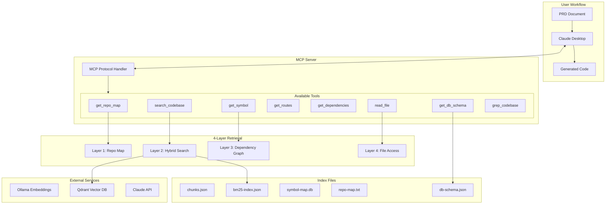
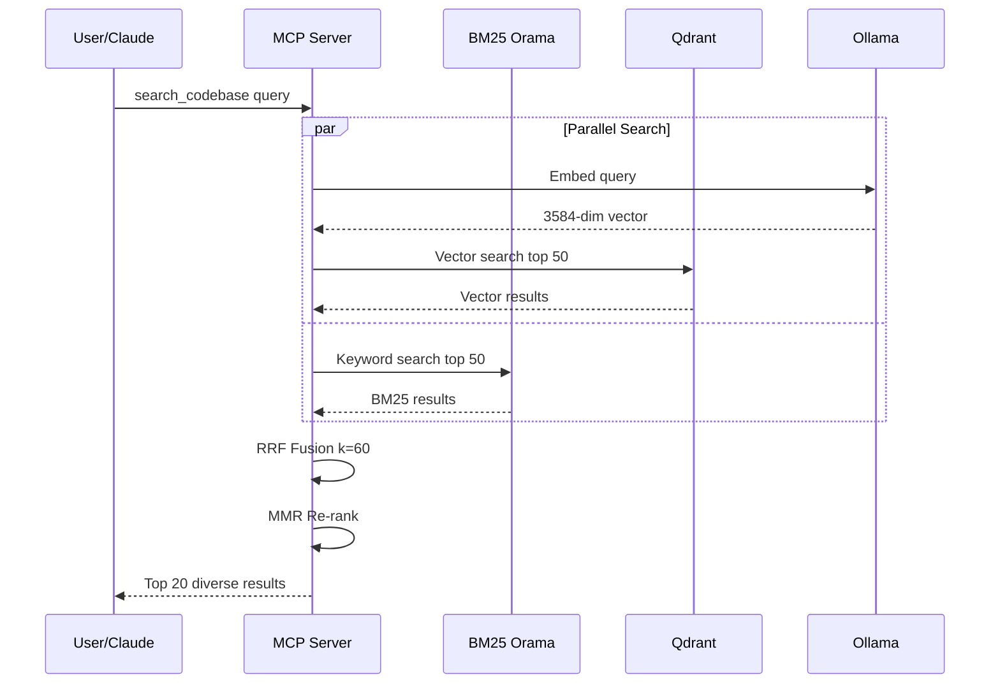
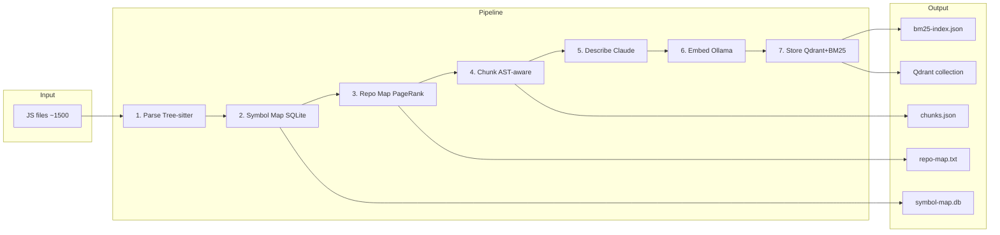
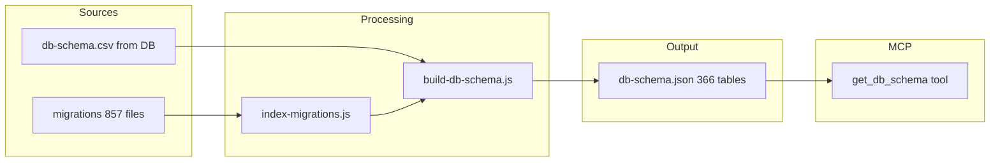
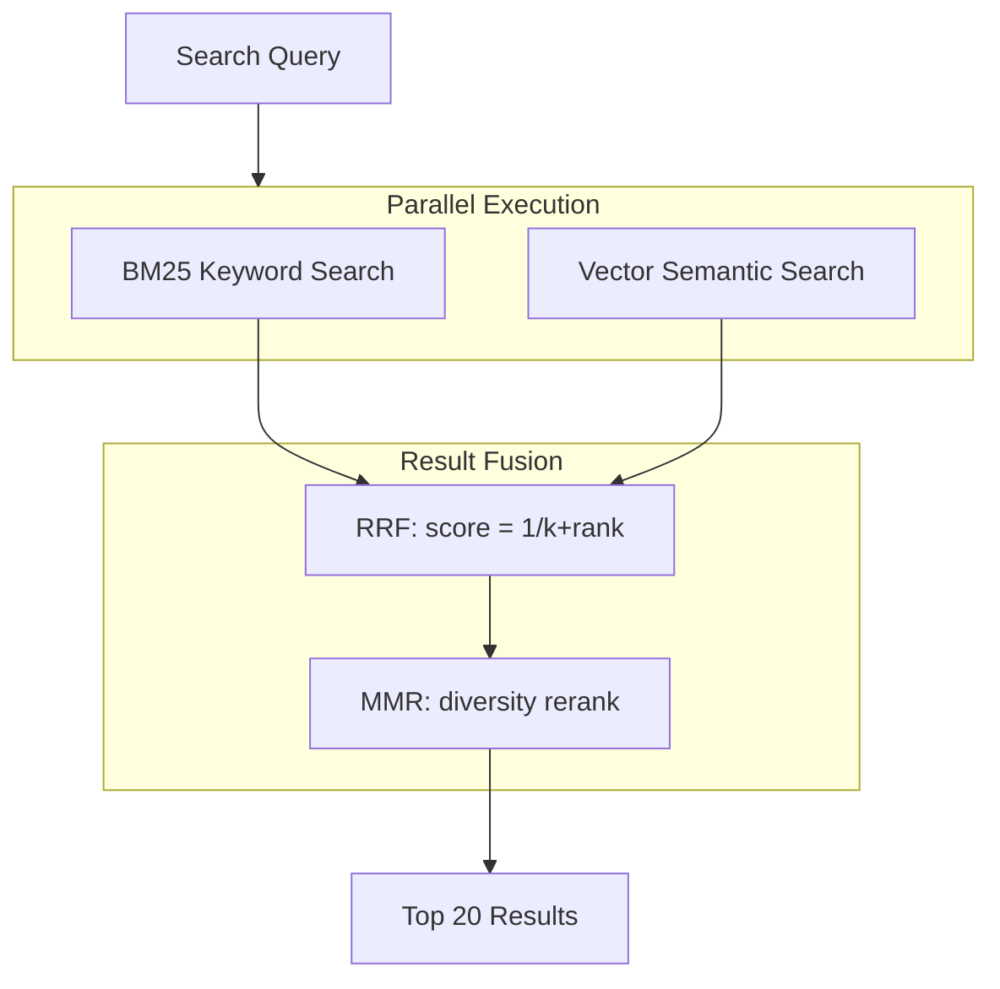
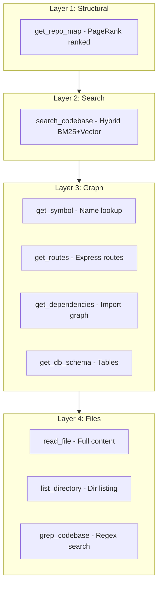
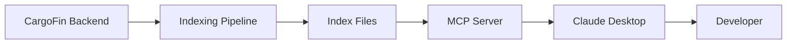

# Developer Agent Architecture

## System Overview

---

## Search Flow

---

## Indexing Pipeline

---

## DB Schema Hybrid

---

## Layer 2: Hybrid Search Detail

---

## 4-Layer Architecture

---

## Component Summary

| Component | Technology | Purpose |
|-----------|------------|---------|
| MCP Server | Node.js stdio | Exposes tools to Claude Desktop |
| BM25 Index | Orama | Keyword search |
| Vector Store | Qdrant | Semantic search |
| Embeddings | Ollama nomic-embed-code | 3584-dim code embeddings |
| Symbol Map | SQLite | Function/class lookup |
| Repo Map | PageRank | Structural overview |
| Descriptions | Claude Haiku | Code chunk summaries |

---

## Data Flow Summary

